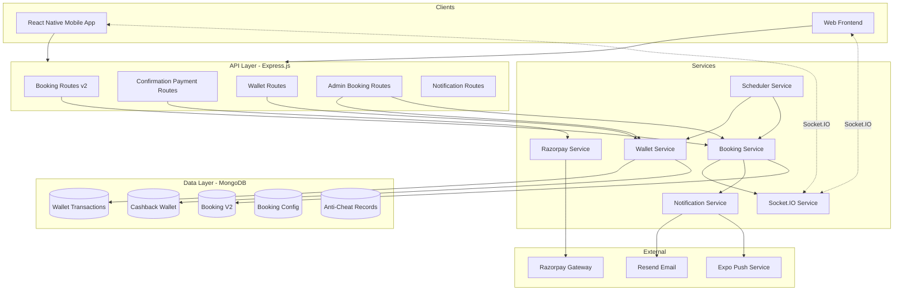
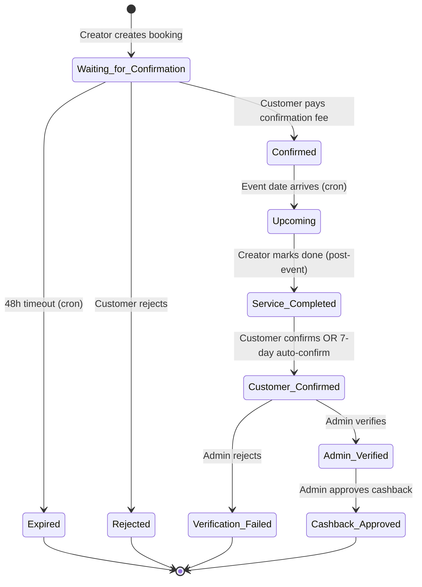
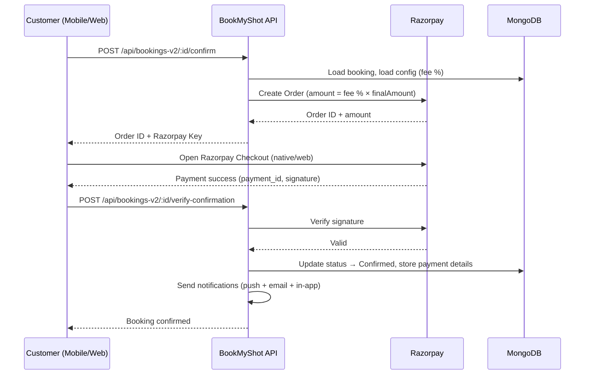

# Design Document: Booking Flow Redesign

## Overview

This design replaces the existing customer-initiated linear booking system with a **creator-initiated booking model**. The new lifecycle is:

1. Customer browses creator profiles (phone/WhatsApp visible)
2. Creator creates a booking after offline negotiation → status: `Waiting_for_Confirmation`
3. Customer reviews and confirms (paying a configurable confirmation fee via Razorpay) → `Confirmed`
4. Booking becomes `Upcoming` on event date
5. Creator marks service completed post-event → `Service_Completed`
6. Customer confirms event (or auto-confirmed after 7 days) → `Customer_Confirmed`
7. Admin verifies and approves cashback → `Admin_Verified` → `Cashback_Approved`
8. Cashback credited to customer's wallet

Supporting subsystems: Cashback Wallet, Anti-Cheating Policy enforcement, Admin Configuration (fee/cashback percentages), 48-hour booking expiry, and Admin Booking Management dashboard.

### Design Rationale

The creator-initiated model solves key business problems:
- **Reduces friction**: Creators discuss offline first, then formalize the agreement on-platform
- **Ensures platform revenue**: Confirmation fee collected at confirmation time
- **Incentivizes platform usage**: Cashback rewards customers who complete bookings through the system
- **Discourages off-platform deals**: Anti-cheating policy with warnings/suspensions

## Architecture

### High-Level System Diagram



### Booking Lifecycle State Machine



### Payment Flow Sequence



## Components and Interfaces

### New API Endpoints

| Method | Path | Auth | Description |
|--------|------|------|-------------|
| POST | `/api/bookings-v2` | Creator | Create new booking (creator-initiated) |
| GET | `/api/bookings-v2/my` | User | Get customer's bookings (new flow) |
| GET | `/api/bookings-v2/creator` | Creator | Get creator's bookings (new flow) |
| GET | `/api/bookings-v2/:id` | Auth | Get booking detail |
| POST | `/api/bookings-v2/:id/confirm` | User | Initiate confirmation fee payment |
| POST | `/api/bookings-v2/:id/verify-confirmation` | User | Verify Razorpay payment and confirm booking |
| POST | `/api/bookings-v2/:id/reject` | User | Reject booking with optional reason |
| POST | `/api/bookings-v2/:id/mark-complete` | Creator | Mark service completed (post-event) |
| POST | `/api/bookings-v2/:id/customer-confirm` | User | Customer confirms event completion |
| POST | `/api/bookings-v2/:id/admin-verify` | Admin | Admin verifies booking |
| POST | `/api/bookings-v2/:id/admin-approve-cashback` | Admin | Admin approves cashback |
| POST | `/api/bookings-v2/:id/admin-reject` | Admin | Admin rejects verification |
| GET | `/api/bookings-v2/admin/all` | Admin | All bookings with filters |
| GET | `/api/bookings-v2/admin/analytics` | Admin | Booking analytics |
| GET | `/api/wallet/balance` | User | Get wallet balance |
| GET | `/api/wallet/transactions` | User | Get transaction history |
| GET | `/api/wallet/admin/:userId` | Admin | View user's wallet (admin) |
| GET | `/api/admin/booking-config` | Admin | Get fee/cashback config |
| PUT | `/api/admin/booking-config` | Admin | Update fee/cashback config |
| POST | `/api/admin/anti-cheat/warn` | Admin | Issue anti-cheat warning |
| POST | `/api/admin/anti-cheat/suspend` | Admin | Suspend creator for violation |
| GET | `/api/admin/anti-cheat/records` | Admin | Get violation records |

### Component Structure

**Backend (server/)**
```
server/
├── models/
│   ├── BookingV2.js          # New booking schema
│   ├── CashbackWallet.js     # Wallet balance per user
│   ├── WalletTransaction.js  # Credit/debit records
│   ├── BookingConfig.js      # Fee/cashback percentages
│   └── AntiCheatRecord.js    # Violation logs
├── routes/
│   ├── bookingsV2.js         # New booking lifecycle routes
│   ├── wallet.js             # Wallet routes
│   └── admin/
│       ├── bookingConfig.js  # Admin config routes
│       └── antiCheat.js      # Anti-cheat management
├── services/
│   ├── bookingV2Service.js   # Business logic for new bookings
│   ├── walletService.js      # Wallet credit/debit logic
│   └── scheduler.js          # Add expiry + auto-confirm crons
└── middleware/
    └── auth.js               # Existing (unchanged)
```

**Mobile App (mobile/src/)**
```
mobile/src/
├── screens/
│   ├── BookingV2/
│   │   ├── CreateBookingScreen.tsx    # Creator form
│   │   ├── BookingDetailScreen.tsx    # Full detail with actions
│   │   ├── CustomerReviewScreen.tsx   # Confirm/reject
│   │   ├── UpcomingBookingScreen.tsx  # Countdown
│   │   └── BookingListScreen.tsx      # List with status tabs
│   └── Wallet/
│       ├── WalletScreen.tsx           # Balance + history
│       └── TransactionDetailScreen.tsx
├── services/
│   ├── bookingV2.ts          # API calls for new booking flow
│   └── wallet.ts             # Wallet API calls
└── components/
    ├── CountdownTimer.tsx     # Days/hours countdown
    ├── BookingStatusBadge.tsx # Color-coded status
    └── ConfirmationFeeCard.tsx # Fee breakdown display
```

## Data Models

### BookingV2 Schema (New)

```javascript
const bookingV2Schema = new mongoose.Schema({
  // Participants
  creator: { type: ObjectId, ref: "Creator", required: true },
  customer: { type: ObjectId, ref: "User", required: true },
  customerPhone: { type: String, required: true }, // Used for lookup/SMS invite

  // Event details (filled by creator)
  customerName: { type: String, required: true },
  eventDate: { type: Date, required: true },
  eventTime: { type: String, required: true },
  eventLocation: { type: String, required: true },
  category: { type: String, required: true },
  subcategory: { type: String, default: "" },
  finalAmount: { type: Number, required: true, min: 1 },
  advanceAmount: { type: Number, default: 0 },
  notes: { type: String, default: "" },

  // Status lifecycle
  status: {
    type: String,
    enum: [
      "Waiting_for_Confirmation",
      "Confirmed",
      "Upcoming",
      "Service_Completed",
      "Customer_Confirmed",
      "Admin_Verified",
      "Cashback_Approved",
      "Rejected",
      "Expired",
      "Verification_Failed"
    ],
    default: "Waiting_for_Confirmation"
  },

  // Confirmation fee payment
  confirmationFeePercent: { type: Number, required: true }, // Snapshot at creation
  confirmationFeeAmount: { type: Number, default: 0 },
  razorpayOrderId: { type: String, default: "" },
  razorpayPaymentId: { type: String, default: "" },
  razorpaySignature: { type: String, default: "" },
  paymentStatus: {
    type: String,
    enum: ["pending", "paid", "failed"],
    default: "pending"
  },
  paidAt: { type: Date },

  // Cashback
  cashbackPercent: { type: Number, default: 0 }, // Snapshot at creation
  cashbackAmount: { type: Number, default: 0 },
  cashbackCredited: { type: Boolean, default: false },
  cashbackCreditedAt: { type: Date },

  // Rejection
  rejectionReason: { type: String, default: "" },
  rejectedAt: { type: Date },

  // Service completion
  serviceCompletedAt: { type: Date },
  customerConfirmedAt: { type: Date },
  autoConfirmed: { type: Boolean, default: false },

  // Admin verification
  adminVerifiedAt: { type: Date },
  adminVerifiedBy: { type: ObjectId, ref: "User" },
  verificationFailedReason: { type: String, default: "" },

  // Expiry
  expiresAt: { type: Date }, // Set at creation = createdAt + 48h
  expiredAt: { type: Date },

  // Reference
  bookingRef: { type: String, unique: true }, // e.g., "BMS-BK-20240115-001"
}, { timestamps: true });

// Indexes
bookingV2Schema.index({ creator: 1, status: 1 });
bookingV2Schema.index({ customer: 1, status: 1 });
bookingV2Schema.index({ status: 1, expiresAt: 1 }); // For expiry cron
bookingV2Schema.index({ status: 1, serviceCompletedAt: 1 }); // For auto-confirm cron
bookingV2Schema.index({ bookingRef: 1 }, { unique: true });
```

### CashbackWallet Schema (New)

```javascript
const cashbackWalletSchema = new mongoose.Schema({
  user: { type: ObjectId, ref: "User", required: true, unique: true },
  balance: { type: Number, default: 0, min: 0 },
  totalEarned: { type: Number, default: 0 },
  totalTransactions: { type: Number, default: 0 },
}, { timestamps: true });

cashbackWalletSchema.index({ user: 1 }, { unique: true });
```

### WalletTransaction Schema (New)

```javascript
const walletTransactionSchema = new mongoose.Schema({
  user: { type: ObjectId, ref: "User", required: true },
  wallet: { type: ObjectId, ref: "CashbackWallet", required: true },
  type: { type: String, enum: ["credit", "debit"], required: true },
  amount: { type: Number, required: true, min: 0 },
  description: { type: String, required: true },
  bookingRef: { type: String, default: "" },
  booking: { type: ObjectId, ref: "BookingV2" },
  balanceAfter: { type: Number, required: true },
}, { timestamps: true });

walletTransactionSchema.index({ user: 1, createdAt: -1 });
walletTransactionSchema.index({ wallet: 1 });
```

### BookingConfig Schema (New)

```javascript
const bookingConfigSchema = new mongoose.Schema({
  key: { type: String, default: "booking_flow_config", unique: true },
  confirmationFeePercent: { type: Number, default: 5, min: 0, max: 100 },
  cashbackPercent: { type: Number, default: 2, min: 0, max: 100 },
  bookingExpiryHours: { type: Number, default: 48 },
  autoConfirmDays: { type: Number, default: 7 },
  updatedBy: { type: ObjectId, ref: "User" },
  effectiveFrom: { type: Date, default: Date.now },
}, { timestamps: true });
```

### AntiCheatRecord Schema (New)

```javascript
const antiCheatRecordSchema = new mongoose.Schema({
  creator: { type: ObjectId, ref: "Creator", required: true },
  action: { type: String, enum: ["warning", "suspension", "penalty"], required: true },
  reason: { type: String, required: true },
  issuedBy: { type: ObjectId, ref: "User", required: true },
  evidence: { type: String, default: "" },
  resolved: { type: Boolean, default: false },
  resolvedAt: { type: Date },
}, { timestamps: true });

antiCheatRecordSchema.index({ creator: 1, createdAt: -1 });
```

### Existing Schema Modifications

**User model** — No changes needed. The `pushToken` and `pushPlatform` fields already support notifications.

**Creator model** — Add field for anti-cheat tracking:
```javascript
// Add to existing Creator schema
antiCheatWarnings: { type: Number, default: 0 },
suspended: { type: Boolean, default: false },
suspendedAt: { type: Date },
suspendReason: { type: String, default: "" },
```

## Scheduled Tasks (Cron Jobs)

### 1. Booking Expiry — Every 15 minutes

```javascript
// Runs every 15 minutes to expire stale bookings
cron.schedule("*/15 * * * *", async () => {
  const now = new Date();
  const expired = await BookingV2.updateMany(
    { status: "Waiting_for_Confirmation", expiresAt: { $lte: now } },
    { $set: { status: "Expired", expiredAt: now } }
  );
  // Notify affected parties for each expired booking
});
```

### 2. Auto-Confirm Customer (7-day timeout) — Daily at 9 AM IST

```javascript
// Auto-confirms if customer hasn't responded 7 days after service completion
cron.schedule("0 9 * * *", async () => {
  const cutoff = new Date(Date.now() - 7 * 86400000);
  const bookings = await BookingV2.find({
    status: "Service_Completed",
    serviceCompletedAt: { $lte: cutoff }
  });
  for (const booking of bookings) {
    booking.status = "Customer_Confirmed";
    booking.customerConfirmedAt = new Date();
    booking.autoConfirmed = true;
    await booking.save();
    // Notify admin for verification
  }
});
```

### 3. Upcoming Status Transition — Daily at 12:01 AM IST

```javascript
// Transition Confirmed → Upcoming when event date arrives
cron.schedule("1 0 * * *", async () => {
  const today = new Date();
  today.setHours(0, 0, 0, 0);
  await BookingV2.updateMany(
    { status: "Confirmed", eventDate: { $lte: today } },
    { $set: { status: "Upcoming" } }
  );
});
```

## Confirmation Fee Payment Flow

1. **Customer taps Confirm** → Client calls `POST /api/bookings-v2/:id/confirm`
2. **Server calculates fee** → `confirmationFeeAmount = finalAmount × (confirmationFeePercent / 100)`
3. **Server creates Razorpay Order** → Uses existing `razorpayService.createOrder(amount, "INR", receiptId, notes)`
4. **Server returns** → `{ orderId, amount, keyId }` to client
5. **Client opens Razorpay Checkout** → Uses `react-native-razorpay` (mobile) or Razorpay.js (web)
6. **On success** → Client calls `POST /api/bookings-v2/:id/verify-confirmation` with `{ razorpay_order_id, razorpay_payment_id, razorpay_signature }`
7. **Server verifies signature** → Uses existing `razorpayService.verifyPaymentSignature()`
8. **Server updates booking** → Status → `Confirmed`, stores payment IDs, sends notifications

This reuses the existing Razorpay integration pattern (Orders API + signature verification) already established in `server/services/razorpayService.js`.

## Notification Flow

All notifications follow the existing pattern where creating a `Notification` document auto-triggers push notification delivery (via the `post("save")` hook on the Notification model) and Socket.IO real-time event.

| Event | Recipients | Channels |
|-------|-----------|----------|
| Booking created | Customer | Push + In-app + SMS (if unregistered) |
| Booking confirmed | Creator + Customer | Push + In-app + Email |
| Booking rejected | Creator | Push + In-app |
| Booking expired | Creator + Customer | Push + In-app |
| Service completed | Customer | Push + In-app |
| Customer confirmed | Admin | In-app |
| Auto-confirmed (7 days) | Admin + Customer | Push + In-app |
| Admin verified | Creator + Customer | In-app |
| Cashback approved | Customer | Push + In-app |
| Verification failed | Creator + Customer | Push + In-app |

## Cross-Platform Considerations

- **Mobile (React Native)**: Native Razorpay checkout via `react-native-razorpay`, Socket.IO for real-time, Expo push notifications
- **Web**: Razorpay.js checkout overlay, Socket.IO for real-time, browser notifications (if enabled)
- **State sync**: All booking state changes emit Socket.IO events (`booking:updated`) to both platforms simultaneously
- **Countdown timer**: Computed client-side from `eventDate` — no server polling needed
- **Offline handling**: Mobile app caches last-known booking state, shows stale indicator, refreshes on reconnect


## Correctness Properties

*A property is a characteristic or behavior that should hold true across all valid executions of a system — essentially, a formal statement about what the system should do. Properties serve as the bridge between human-readable specifications and machine-verifiable correctness guarantees.*

### Property 1: Creator-Only Booking Creation

*For any* user with a role other than "creator", attempting to create a new booking SHALL result in a 403 authorization error and no booking document being persisted.

**Validates: Requirements 2.1**

### Property 2: Booking Input Validation Rejects Invalid Data

*For any* booking creation payload where at least one of the following holds: a required field (customerName, customerPhone, eventDate, eventTime, eventLocation, category, finalAmount) is missing or empty, OR eventDate is in the past, OR finalAmount is ≤ 0 — the system SHALL reject the request and no booking document SHALL be created.

**Validates: Requirements 2.2, 2.7, 2.8**

### Property 3: New Booking Initial State Invariant

*For any* valid booking creation input, the resulting booking document SHALL have status = "Waiting_for_Confirmation", paymentStatus = "pending", and expiresAt = createdAt + 48 hours.

**Validates: Requirements 2.4, 13.1**

### Property 4: Confirmation Fee Calculation

*For any* positive finalAmount and any confirmationFeePercent in [0, 100], the computed confirmation fee SHALL equal `Math.round(finalAmount * confirmationFeePercent / 100)`.

**Validates: Requirements 4.1**

### Property 5: Payment Verification State Transition

*For any* booking in "Waiting_for_Confirmation" status: if payment verification succeeds (valid Razorpay signature), the booking SHALL transition to "Confirmed" and store the razorpayOrderId, razorpayPaymentId, and confirmationFeeAmount. If verification fails (invalid signature), the booking SHALL remain in "Waiting_for_Confirmation" with no payment fields stored.

**Validates: Requirements 4.3, 4.4, 4.5**

### Property 6: Booking State Machine Valid Transitions

*For any* booking, the following state transitions are the ONLY valid transitions:
- Waiting_for_Confirmation → Confirmed (payment verified)
- Waiting_for_Confirmation → Rejected (customer rejects)
- Waiting_for_Confirmation → Expired (48h timeout)
- Confirmed → Upcoming (event date arrives)
- Upcoming → Service_Completed (creator marks complete post-event)
- Service_Completed → Customer_Confirmed (customer confirms or 7-day auto)
- Customer_Confirmed → Admin_Verified (admin verifies)
- Customer_Confirmed → Verification_Failed (admin rejects)
- Admin_Verified → Cashback_Approved (admin approves cashback)

Any attempt to perform a transition not in this set SHALL be rejected.

**Validates: Requirements 3.3, 6.4, 7.1, 7.2, 8.2, 9.2, 9.3, 9.6**

### Property 7: Service Completion Guard

*For any* booking, the Creator SHALL only be able to mark service as completed when the booking status is "Upcoming" AND the current date is on or after the event date. Attempts to mark complete in any other status or before the event date SHALL be rejected.

**Validates: Requirements 7.1, 7.4**

### Property 8: Auto-Confirm After 7 Days

*For any* booking in "Service_Completed" status where serviceCompletedAt is more than 7 days in the past, the auto-confirm job SHALL transition it to "Customer_Confirmed" with autoConfirmed = true.

**Validates: Requirements 8.4**

### Property 9: Booking Expiry After 48 Hours

*For any* booking in "Waiting_for_Confirmation" status where expiresAt ≤ current time, the expiry job SHALL transition it to "Expired" status.

**Validates: Requirements 13.1**

### Property 10: Cashback Calculation

*For any* positive finalAmount and any cashbackPercent in [0, 100], the computed cashback amount SHALL equal `Math.round(finalAmount * cashbackPercent / 100)`.

**Validates: Requirements 9.5**

### Property 11: Wallet Credit Correctness

*For any* booking transitioning to "Cashback_Approved" with cashbackAmount > 0, the customer's wallet balance SHALL increase by exactly cashbackAmount, and a WalletTransaction record SHALL be created with type = "credit", the correct amount, and the booking reference.

**Validates: Requirements 9.4, 10.3**

### Property 12: Wallet Balance Non-Negativity

*For any* sequence of wallet operations (credits and potential future debits), the wallet balance SHALL never be less than zero.

**Validates: Requirements 10.4**

### Property 13: Configuration Non-Retroactivity

*For any* existing booking and any subsequent update to BookingConfig (fee or cashback percentage), the existing booking's snapshotted confirmationFeePercent and cashbackPercent SHALL remain unchanged.

**Validates: Requirements 12.6**

### Property 14: Config Snapshot at Creation

*For any* booking created after a configuration change, the booking's confirmationFeePercent SHALL equal the current BookingConfig.confirmationFeePercent and cashbackPercent SHALL equal the current BookingConfig.cashbackPercent at the time of creation.

**Validates: Requirements 12.3, 12.4**

## Error Handling

### Payment Errors

| Error | Handling |
|-------|----------|
| Razorpay order creation fails | Return 502 + user-friendly message. Booking stays in Waiting_for_Confirmation. Log error. |
| Razorpay signature verification fails | Return 400 "Payment verification failed". Booking unchanged. |
| Razorpay timeout | Return 504. Client can retry confirmation. |
| Double payment attempt (booking already Confirmed) | Return 409 "Booking already confirmed". Idempotent. |

### State Transition Errors

| Error | Handling |
|-------|----------|
| Invalid transition attempted | Return 409 with message: "Cannot perform {action} on booking in {status} status" |
| Booking not found | Return 404 |
| Unauthorized access (wrong role/wrong user) | Return 403 |
| Creator marks complete before event | Return 400 "Cannot complete before event date" |

### Wallet Errors

| Error | Handling |
|-------|----------|
| Wallet not found | Auto-create wallet with 0 balance on first access |
| Concurrent credit (race condition) | Use MongoDB `$inc` atomic operator for balance updates |
| Negative balance attempt | Reject operation, return 400 |

### Cron Job Errors

- All cron jobs wrapped in try/catch
- Errors logged with `[Scheduler]` prefix but do not crash the server
- Failed individual booking transitions are skipped; job continues to next
- Job results logged: count of processed, errored

### Network/Connectivity

- Socket.IO disconnections: Client reconnects automatically (built into Socket.IO)
- Stale state on reconnect: Client re-fetches booking data on Socket.IO reconnect event
- Mobile offline: Show last-known state with "updating..." indicator

## Testing Strategy

### Unit Tests

- **Validation logic**: Test required field validation, date validation, amount validation with concrete examples
- **Fee/cashback calculations**: Edge cases (very small amounts rounding to 0, 100% fee, 0% fee)
- **State guard logic**: Verify each transition guard rejects invalid states
- **Wallet operations**: Test credit function, balance check, concurrent operations

### Property-Based Tests (fast-check)

The project uses Node.js. Property tests will use the [fast-check](https://github.com/dubzzz/fast-check) library.

Configuration:
- Minimum **100 iterations** per property
- Each test references its design property with tag format: `Feature: booking-flow-redesign, Property {N}: {title}`

Properties to implement:
1. Input validation (Property 2) — generate random invalid payloads
2. Fee calculation (Property 4) — generate random amounts and percentages
3. State machine transitions (Property 6) — generate random state + action pairs, verify only valid ones succeed
4. Service completion guard (Property 7) — generate bookings with random dates and statuses
5. Cashback calculation (Property 10) — generate random amounts and percentages
6. Wallet non-negativity (Property 12) — generate random operation sequences
7. Config non-retroactivity (Property 13) — generate bookings then change config, verify snapshots unchanged
8. Config snapshot at creation (Property 14) — generate config changes then bookings, verify match

### Integration Tests

- Razorpay order creation + verification flow (mocked Razorpay)
- Full booking lifecycle: create → confirm → upcoming → complete → customer-confirm → admin-verify → cashback
- Expiry cron: create booking, advance time, run cron, verify expired
- Auto-confirm cron: mark complete, advance 7 days, run cron, verify auto-confirmed
- Notification delivery: verify correct notifications are created at each transition
- Socket.IO events: verify correct events emitted on state changes

### Smoke Tests

- Server starts and connects to MongoDB
- All new routes registered and respond to requests
- BookingConfig seed runs on first startup
- Wallet auto-created on first access
