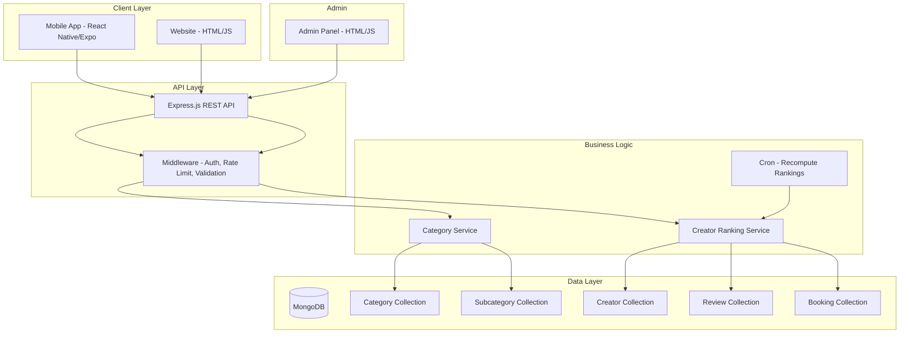
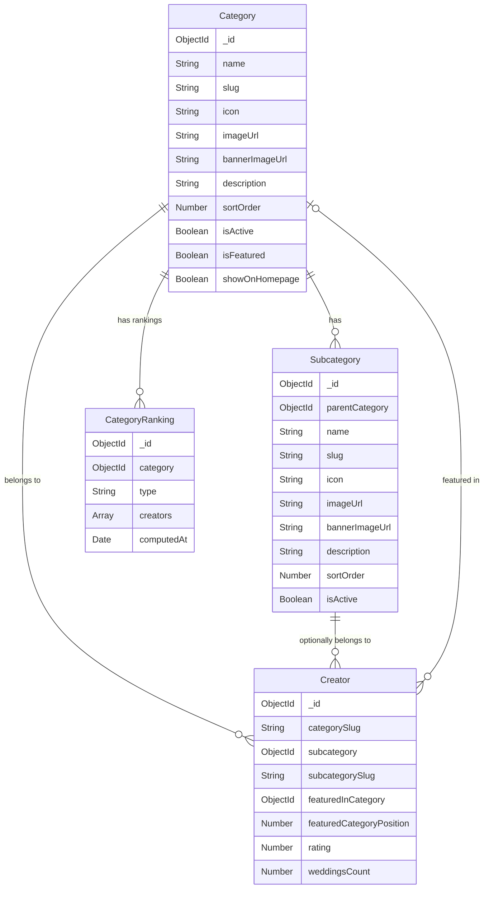

# Design Document: Category-Driven Home Redesign

## Overview

This design transforms the BookMyShot Home Screen from a global creator listing to a category-driven browsing experience. The system introduces a hierarchical category → subcategory data model, per-category curated sections (Top Rated, Trending, Featured, Newly Joined), and full admin management capabilities. A single shared backend API serves both the React Native mobile app and the HTML/JS website.

The key architectural change is moving from a flat creator listing to a dynamically-managed category taxonomy where all display data (names, icons, images, ordering) is admin-controlled via the database—no hardcoded categories remain in client code.

## Architecture



**Key Design Decisions:**

1. **Subcategory as a separate collection**: Rather than embedding subcategories as an array within the Category document, subcategories get their own collection with a `parentCategory` reference. This keeps individual documents small, allows independent indexing, and simplifies the unique slug constraint across both collections.

2. **Computed ranking cache**: Top Rated, Trending, and Newly Joined sections are recomputed every 24 hours by a cron job and cached in a `CategoryRanking` collection. This avoids expensive aggregation queries on every Category Page load.

3. **Single namespace for slugs**: Both Category and Subcategory slugs share a unified uniqueness constraint, enabling clean URL routing (e.g., `/category/:slug` and `/subcategory/:slug`) without collision.

4. **Featured creators per category stored on Creator model**: The existing `featured` and `featuredRank` fields on the Creator model are extended with a `featuredInCategory` reference, keeping featured status scoped to a specific category.

## Components and Interfaces

### Backend Components

#### 1. Category Service (`server/services/categoryService.js`)

Handles CRUD for categories and subcategories, slug generation, validation, and homepage filtering.

```typescript
interface CategoryService {
  // Categories
  createCategory(data: CreateCategoryInput): Promise<Category>;
  updateCategory(id: string, data: Partial<Category>): Promise<Category>;
  deleteCategory(id: string, confirmed: boolean): Promise<DeleteResult>;
  getActiveCategories(options?: { homepage?: boolean }): Promise<Category[]>;
  getAllCategories(): Promise<Category[]>;  // admin view includes inactive
  
  // Subcategories
  createSubcategory(data: CreateSubcategoryInput): Promise<Subcategory>;
  updateSubcategory(id: string, data: Partial<Subcategory>): Promise<Subcategory>;
  deleteSubcategory(id: string, confirmed: boolean): Promise<DeleteResult>;
  getSubcategoriesByCategory(categoryId: string): Promise<Subcategory[]>;
  
  // Featured management
  setFeatured(categoryId: string, featured: boolean): Promise<Category>;
  getFeaturedCategories(): Promise<Category[]>;
  
  // Slug utilities
  generateSlug(name: string): string;
  isSlugUnique(slug: string, excludeId?: string): Promise<boolean>;
}
```

#### 2. Creator Ranking Service (`server/services/creatorRankingService.js`)

Computes and caches curated sections per category.

```typescript
interface CreatorRankingService {
  // Computation (called by cron)
  recomputeAllRankings(): Promise<void>;
  recomputeCategoryRankings(categoryId: string): Promise<void>;
  
  // Queries
  getTopRated(categoryId: string, subcategoryId?: string): Promise<Creator[]>;
  getTrending(categoryId: string, subcategoryId?: string): Promise<Creator[]>;
  getNewlyJoined(categoryId: string, subcategoryId?: string): Promise<Creator[]>;
  getFeaturedCreators(categoryId: string, subcategoryId?: string): Promise<Creator[]>;
}
```

#### 3. Category API Routes (`server/routes/api/categories.js`)

Public REST endpoints consumed by both mobile app and website.

| Method | Endpoint | Description |
|--------|----------|-------------|
| GET | `/api/categories` | List active categories (supports `?homepage=true`) |
| GET | `/api/categories/:slug` | Get category detail with metadata |
| GET | `/api/categories/:slug/subcategories` | List active subcategories for a category |
| GET | `/api/categories/:slug/creators` | List creators with optional `?subcategory=slug` filter |
| GET | `/api/categories/:slug/top-rated` | Cached top rated creators |
| GET | `/api/categories/:slug/trending` | Cached trending creators |
| GET | `/api/categories/:slug/newly-joined` | Cached newly joined creators |
| GET | `/api/categories/:slug/featured-creators` | Admin-curated featured creators |

#### 4. Admin Category Routes (`server/routes/admin/categories.js` - extended)

| Method | Endpoint | Description |
|--------|----------|-------------|
| GET | `/api/admin/categories` | All categories (including inactive) |
| POST | `/api/admin/categories` | Create category |
| PUT | `/api/admin/categories/:id` | Update category |
| DELETE | `/api/admin/categories/:id` | Delete category (with confirmation) |
| POST | `/api/admin/categories/:id/featured` | Toggle featured status |
| GET | `/api/admin/subcategories` | All subcategories |
| POST | `/api/admin/subcategories` | Create subcategory |
| PUT | `/api/admin/subcategories/:id` | Update subcategory |
| DELETE | `/api/admin/subcategories/:id` | Delete subcategory (with confirmation) |
| PUT | `/api/admin/subcategories/reorder` | Batch reorder subcategories |
| PUT | `/api/admin/categories/:id/featured-creators` | Manage featured creators list |

### Frontend Components

#### Mobile App (React Native/Expo)

| Component | Location | Purpose |
|-----------|----------|---------|
| `HomeScreen` | `mobile/src/screens/HomeScreen.tsx` | Redesigned with category slider, no global listing |
| `CategoryPage` | `mobile/src/screens/CategoryScreen.tsx` | New screen for category detail + subcategory browsing |
| `CategorySlider` | `mobile/src/components/CategorySlider.tsx` | Horizontal scrollable category cards |
| `SubcategoryChips` | `mobile/src/components/SubcategoryChips.tsx` | Filterable subcategory chip row |
| `CuratedSection` | `mobile/src/components/CuratedSection.tsx` | Reusable horizontal creator card section |
| `FeaturedCategories` | `mobile/src/components/FeaturedCategories.tsx` | Optional featured categories section |

#### Website (HTML/JS)

| File | Purpose |
|------|---------|
| `public/index.html` | Redesigned homepage with category sections |
| `public/category.html` | Category detail page |
| `public/js/categories.js` | Category API client and rendering logic |

#### Admin Panel (HTML/JS)

| File | Purpose |
|------|---------|
| `public/admin/categories.html` | Category + subcategory CRUD interface |
| `public/admin/js/categories.js` | Admin category management logic |

## Data Models

### Category Model (extended)

```javascript
// server/models/Category.js
const categorySchema = new mongoose.Schema({
  name: { type: String, required: true, minlength: 1, maxlength: 100 },
  slug: { type: String, required: true, unique: true, minlength: 1, maxlength: 120,
           match: /^[a-z0-9]+(?:-[a-z0-9]+)*$/ },
  group: { type: String, default: "Other" },
  icon: { type: String, default: "camera-outline" },
  imageUrl: { type: String, default: "" },
  bannerImageUrl: { type: String, default: "" },
  description: { type: String, default: "", maxlength: 500 },
  sortOrder: { type: Number, default: 0 },
  isActive: { type: Boolean, default: true },
  isFeatured: { type: Boolean, default: false },
  showOnHomepage: { type: Boolean, default: true },
  // Dynamic form fields (existing)
  fields: [fieldDefSchema],
  searchFilters: [filterDefSchema],
}, { timestamps: true });

// Indexes
categorySchema.index({ isActive: 1, sortOrder: 1 });
categorySchema.index({ isFeatured: 1, isActive: 1 });
categorySchema.index({ slug: 1 }, { unique: true });
```

### Subcategory Model (new)

```javascript
// server/models/Subcategory.js
const subcategorySchema = new mongoose.Schema({
  name: { type: String, required: true, minlength: 1, maxlength: 100 },
  slug: { type: String, required: true, minlength: 1, maxlength: 120,
           match: /^[a-z0-9]+(?:-[a-z0-9]+)*$/ },
  parentCategory: { type: mongoose.Schema.Types.ObjectId, ref: "Category", required: true },
  icon: { type: String, default: "" },
  imageUrl: { type: String, default: "" },
  bannerImageUrl: { type: String, default: "" },
  description: { type: String, default: "", maxlength: 500 },
  sortOrder: { type: Number, default: 0 },
  isActive: { type: Boolean, default: true },
}, { timestamps: true });

// Unique slug across the same namespace as Category
subcategorySchema.index({ slug: 1 }, { unique: true });
subcategorySchema.index({ parentCategory: 1, sortOrder: 1 });
subcategorySchema.index({ parentCategory: 1, name: 1 }, { unique: true });
```

### Creator Model (extended fields)

```javascript
// Additional fields on existing Creator schema
{
  subcategory: { type: mongoose.Schema.Types.ObjectId, ref: "Subcategory", default: null },
  subcategorySlug: { type: String, default: "" },
  featuredInCategory: { type: mongoose.Schema.Types.ObjectId, ref: "Category", default: null },
  featuredCategoryPosition: { type: Number, default: 0, min: 1, max: 10 },
}
```

### CategoryRanking Model (new - cache)

```javascript
// server/models/CategoryRanking.js
const categoryRankingSchema = new mongoose.Schema({
  category: { type: mongoose.Schema.Types.ObjectId, ref: "Category", required: true },
  type: { type: String, enum: ["top_rated", "trending", "newly_joined"], required: true },
  creators: [{ type: mongoose.Schema.Types.ObjectId, ref: "Creator" }], // ordered list, max 10
  computedAt: { type: Date, default: Date.now },
}, { timestamps: true });

categoryRankingSchema.index({ category: 1, type: 1 }, { unique: true });
```

### Entity Relationship Diagram



## Correctness Properties

*A property is a characteristic or behavior that should hold true across all valid executions of a system—essentially, a formal statement about what the system should do. Properties serve as the bridge between human-readable specifications and machine-verifiable correctness guarantees.*

### Property 1: Sort Order Invariant

*For any* collection of active categories (or subcategories within a parent), the API response SHALL always return them sorted in ascending order by their `sortOrder` field.

**Validates: Requirements 1.4, 3.2, 7.4, 8.4**

### Property 2: Slug Uniqueness Enforcement

*For any* two entities (Category or Subcategory) in the system, if they share the same slug value, the second creation attempt SHALL be rejected with a duplicate error, regardless of whether the entities are of the same type or different types.

**Validates: Requirements 6.4, 6.5, 7.2**

### Property 3: Schema Validation for Categories and Subcategories

*For any* Category or Subcategory creation/update input, the system SHALL accept the input only if: name is 1–100 characters, slug is 1–120 characters matching `^[a-z0-9]+(-[a-z0-9]+)*$`, description is at most 500 characters, and all required fields are present. Otherwise, the system SHALL reject with a validation error.

**Validates: Requirements 6.2, 6.3**

### Property 4: Subcategory Filtering Correctness

*For any* set of creators belonging to a category and a selected subcategory filter, the API response SHALL contain only creators whose `subcategory` field matches the selected subcategory, and the returned creator count SHALL equal the length of the filtered result set.

**Validates: Requirements 4.1, 4.2, 5.5**

### Property 5: Top Rated Computation Correctness

*For any* category with creators, the Top Rated section SHALL contain at most 10 creators, each having at least 3 reviews, sorted in descending order by average rating. No creator with fewer than 3 reviews shall appear in the results.

**Validates: Requirements 5.1, 10.3**

### Property 6: Trending Computation Correctness

*For any* category with creators, the Trending section SHALL contain at most 10 creators, sorted in descending order by their count of completed bookings within the last 30 days. No creator with zero bookings in the period shall appear.

**Validates: Requirements 5.2, 10.4**

### Property 7: Newly Joined Computation Correctness

*For any* category with creators, the Newly Joined section SHALL contain at most 10 creators whose registration date is within the last 90 days, sorted by most recent first. No creator registered more than 90 days ago shall appear.

**Validates: Requirements 5.4, 10.5**

### Property 8: Featured Section Visibility

*For any* set of categories with varying `isFeatured` and `isActive` flags, the Featured Categories section on the Home Screen SHALL be visible if and only if at least one category has both `isFeatured: true` AND `isActive: true`. The section shall contain only categories meeting both conditions.

**Validates: Requirements 2.4, 9.2, 9.3, 9.4**

### Property 9: Active/Inactive Filtering

*For any* set of categories with varying `isActive` status, the public Category API SHALL return only categories where `isActive: true`, while the admin API SHALL return all categories regardless of active status.

**Validates: Requirements 7.5, 11.5**

### Property 10: Slug Auto-Generation Format

*For any* valid category name input, the auto-generated slug SHALL be a lowercase string containing only alphanumeric characters and hyphens, with no leading/trailing hyphens and no consecutive hyphens.

**Validates: Requirements 7.1**

### Property 11: Deletion Warning Count Accuracy

*For any* Category or Subcategory that has associated creators, attempting to delete it SHALL return a warning containing a count that exactly matches the number of creators currently associated with that entity.

**Validates: Requirements 7.6, 8.7**

### Property 12: Subcategory Deletion Reassignment

*For any* subcategory deletion where associated creators exist, after confirmed deletion, all previously-associated creators SHALL have their `subcategory` reference set to null and remain associated with the parent category only.

**Validates: Requirements 8.8**

### Property 13: Parent Disable/Re-Enable Preserves Subcategory States

*For any* category with subcategories having various `isActive` states, disabling then re-enabling the parent category SHALL result in each subcategory retaining its individual `isActive` state from before the parent was disabled.

**Validates: Requirements 8.6**

### Property 14: Featured Category Maximum Limit

*For any* sequence of "mark as featured" operations, the system SHALL never allow more than 10 categories to be marked as featured simultaneously. The 11th attempt SHALL be rejected with an error.

**Validates: Requirements 9.1, 9.5**

### Property 15: Single Subcategory Selection

*For any* sequence of subcategory selections on the Category Page, exactly one subcategory (or none if "All" is selected) SHALL be in the active/selected state at any point in time.

**Validates: Requirements 4.5**

### Property 16: Homepage Filter Correctness

*For any* set of categories with varying `showOnHomepage` flags, requesting categories with the homepage filter parameter SHALL return only categories where `showOnHomepage: true` AND `isActive: true`, sorted by ascending `sortOrder`.

**Validates: Requirements 11.5, 1.4**

### Property 17: Error Response Hides Internals

*For any* API error response from the Category API, the response body SHALL NOT contain stack traces, file paths, database connection strings, or internal implementation details.

**Validates: Requirements 11.4**

## Error Handling

### API Error Strategy

| Scenario | HTTP Status | Response Format |
|----------|-------------|-----------------|
| Category not found | 404 | `{ success: false, message: "Category not found" }` |
| Validation error (slug format, name length) | 400 | `{ success: false, message: "<field> is invalid", errors: [...] }` |
| Duplicate slug | 409 | `{ success: false, message: "A category or subcategory with this slug already exists" }` |
| Featured limit reached (>10) | 400 | `{ success: false, message: "Maximum of 10 featured categories reached" }` |
| Delete with associations (unconfirmed) | 200 | `{ success: false, requiresConfirmation: true, associatedCount: N, message: "..." }` |
| Database connection failure | 500 | `{ success: false, message: "Unable to process request. Please try again later." }` |
| Request timeout (>5s) | 504 | `{ success: false, message: "Request timed out" }` |

### Client Error Handling

- **Mobile App**: Shows inline error states with retry buttons. Failed sections don't block rendering of other sections. Pull-to-refresh always available.
- **Website**: Displays placeholder content for failed sections with a "Try Again" link. Graceful degradation: page renders with available data.
- **Admin Panel**: Inline form validation errors with specific messages. Modal confirmations for destructive actions. Toast notifications for success/failure.

### Data Integrity

- Subcategory deletion reassigns creators to parent category automatically
- Category deletion requires explicit confirmation when creators exist
- Disabled categories are hidden from users but preserved in database
- Computed rankings are stale-safe: if recomputation fails, the last valid cache is served

## Testing Strategy

### Property-Based Testing

This feature is well-suited for property-based testing due to the numerous filtering, sorting, and validation invariants.

**Library**: [fast-check](https://github.com/dubzzz/fast-check) (JavaScript PBT library)

**Configuration**:
- Minimum 100 iterations per property test
- Each test tagged with: `Feature: category-driven-home-redesign, Property {N}: {title}`

**Properties to implement as PBT** (from Correctness Properties above):
- Property 1: Sort order invariant
- Property 2: Slug uniqueness enforcement
- Property 3: Schema validation
- Property 4: Subcategory filtering correctness
- Property 5: Top Rated computation
- Property 6: Trending computation
- Property 7: Newly Joined computation
- Property 8: Featured section visibility
- Property 9: Active/inactive filtering
- Property 10: Slug auto-generation format
- Property 11: Deletion warning count accuracy
- Property 12: Subcategory deletion reassignment
- Property 13: Parent disable/re-enable state preservation
- Property 14: Featured category maximum limit
- Property 15: Single subcategory selection
- Property 16: Homepage filter correctness
- Property 17: Error response hides internals

### Unit Tests (Example-Based)

- Home screen layout order verification (Requirement 2.1)
- Absence of global creator listing and "Best Reviewed" section (Requirements 2.2, 2.3)
- Category Page renders all metadata fields (Requirement 3.1)
- "All" chip clears subcategory filter (Requirement 4.3)
- Creator registration cascading dropdown behavior (Requirements 12.1, 12.4)
- Admin CRUD operations for categories and subcategories (Requirements 7.1, 8.1, 8.3)
- Featured creator management (Requirements 10.1, 10.2)

### Integration Tests

- Admin creates/edits/disables category → client API reflects change (Requirement 1.3)
- Category API response time under 2 seconds with 100 categories (Requirement 11.3)
- Creator category change triggers exclusion from previous rankings (Requirement 10.6)
- End-to-end: mobile app fetches categories, renders, navigates to category page

### Edge Case Tests

- Category API timeout (5 seconds) triggers placeholder UI (Requirement 1.6)
- Category with zero subcategories hides subcategory section (Requirement 3.3)
- Empty subcategory shows "no creators" state (Requirement 4.6)
- Fewer than 3 creators in curated section shows only available (Requirement 5.6)
- Section data failure doesn't block other sections (Requirement 2.5)
- Delete non-existent category returns 404 (Requirement 7.7)

### Test File Structure

```
server/
  __tests__/
    services/
      categoryService.test.js        # Unit + PBT for category logic
      creatorRankingService.test.js   # PBT for ranking computations
    routes/
      categories.integration.test.js # API integration tests
    models/
      category.validation.test.js    # PBT for schema validation
      subcategory.validation.test.js # PBT for schema validation
mobile/
  __tests__/
    screens/
      HomeScreen.test.tsx            # Layout and rendering tests
      CategoryScreen.test.tsx        # Category page behavior tests
    components/
      SubcategoryChips.test.tsx      # Selection state tests (PBT)
```
