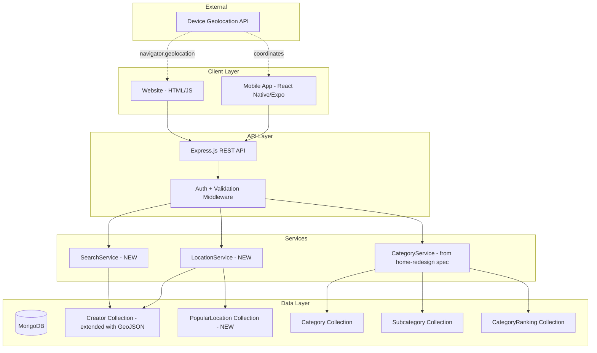
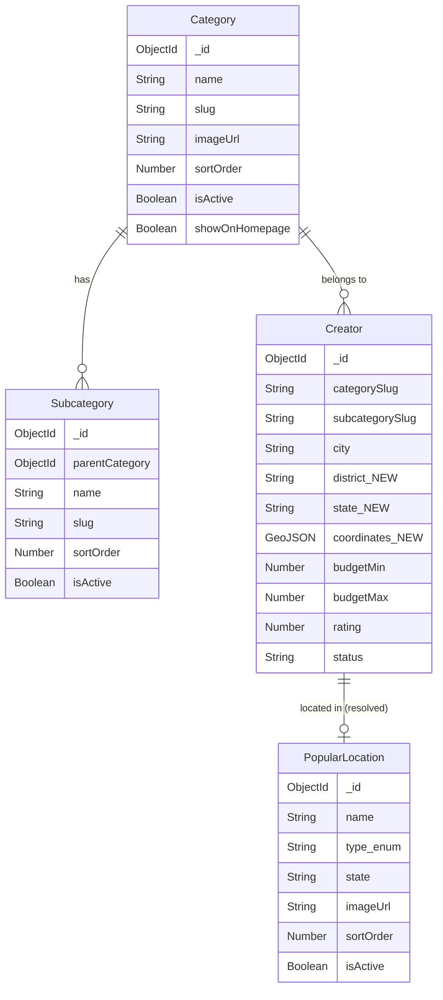

# Design Document: Category Navigation Redesign

## Overview

This design introduces a redesigned category navigation flow, replacing the current "category tap → Discover page" pattern with a direct "category tap → Category Page" experience. It also transforms the Home Screen category section from a horizontal scroll to a 2-column premium grid, adds location-based creator discovery ("Near Me"), admin-managed Popular Locations, debounced search, and advanced multi-filter capabilities on Category Pages.

**Key changes from the current system:**
1. **Navigation flow fix**: Category taps navigate to a new `CategoryPage` screen instead of the `SearchScreen` (Discover tab)
2. **2-column grid layout**: Replaces the current `FlatList horizontal` category slider with a responsive 2-column `FlatList` grid
3. **Geolocation on Creator model**: Adds `coordinates` (GeoJSON Point) and `state`/`district` fields to enable proximity-based queries
4. **Near Me section**: A new location-aware component on every Category Page showing nearby creators within 25km
5. **Popular Locations**: A new `PopularLocation` model with admin CRUD for curated city/district/destination entries
6. **Search + Advanced Filters**: Category-scoped search with debounce, plus multi-criteria filter panel (location, rating, price, availability)

**Relationship to `category-driven-home-redesign` spec:**
This design references and extends the Subcategory model, CategoryRanking cache, and CategoryService/CreatorRankingService defined in that spec. It does NOT redefine those models. It adds new fields to Creator, a new PopularLocation model, new API routes for Near Me/search/filters, and new frontend screens/components.

## Architecture



**Key Design Decisions:**

1. **GeoJSON 2dsphere index on Creator**: MongoDB's native geospatial queries (`$nearSphere`, `$geoWithin`) give us efficient proximity search within 25km without external services. The Creator model gets a `coordinates` field as a GeoJSON Point.

2. **Reverse geocoding done client-side**: Rather than building a server-side reverse geocoding service, the client sends raw lat/lng to the API. The server resolves district/city/state by matching against the existing District model and a new `state` field. This avoids external geocoding API costs.

3. **PopularLocation as a unified collection**: Instead of three separate collections (cities, districts, destinations), a single `PopularLocation` model with a `type` enum handles all three. This simplifies admin CRUD and API endpoints.

4. **Category Page as a new stack screen**: Both `CustomerNavigator` and `GuestNavigator` get a new `CategoryPage` stack screen. Navigation changes from `navigation.navigate('Discover', { category })` to `navigation.navigate('CategoryPage', { slug, name })`.

5. **Search debounce at 500ms client-side**: The search input uses client-side debounce before making API calls, reducing server load. The API endpoint supports `?search=` with case-insensitive partial matching.

6. **Filter state managed client-side**: Multiple active filters are composed into query parameters and sent as a single API request. The server applies all filters with MongoDB `$and` logic.

## Components and Interfaces

### Backend Components

#### 1. LocationService (`server/services/locationService.js`) — NEW

Handles geospatial queries and location resolution.

```typescript
interface LocationService {
  // Near Me: find creators within radius of coordinates
  findNearbyCreators(params: {
    categorySlug: string;
    lat: number;
    lng: number;
    radiusKm?: number; // default 25
    limit?: number;    // default 20
  }): Promise<Creator[]>;

  // Filter by city/district/state
  findCreatorsByLocation(params: {
    categorySlug: string;
    city?: string;
    district?: string;
    state?: string;
    limit?: number;
  }): Promise<Creator[]>;

  // Resolve coordinates to city/district/state
  resolveLocation(lat: number, lng: number): Promise<{
    city: string | null;
    district: string | null;
    state: string | null;
  }>;

  // Popular Locations CRUD
  getPopularLocations(type?: 'city' | 'district' | 'destination'): Promise<PopularLocation[]>;
  createPopularLocation(data: CreatePopularLocationInput): Promise<PopularLocation>;
  updatePopularLocation(id: string, data: Partial<PopularLocation>): Promise<PopularLocation>;
  deletePopularLocation(id: string): Promise<void>;
  reorderPopularLocations(ids: string[]): Promise<void>;
}
```

#### 2. SearchService (`server/services/searchService.js`) — NEW

Handles category-scoped search and advanced filtering.

```typescript
interface SearchService {
  searchCreators(params: {
    categorySlug: string;
    subcategorySlug?: string;
    search?: string;           // min 2 chars, max 100 chars
    district?: string;
    city?: string;
    state?: string;
    ratingMin?: number;        // 1-5
    priceMin?: number;         // 0-10,000,000
    priceMax?: number;
    availableDate?: string;    // ISO date
    page?: number;
    limit?: number;            // default 20
    sortBy?: 'proximity' | 'rating' | 'price_asc' | 'price_desc';
    lat?: number;
    lng?: number;
  }): Promise<{ creators: Creator[]; total: number; page: number }>;
}
```

#### 3. New API Routes

| Method | Endpoint | Description |
|--------|----------|-------------|
| GET | `/api/categories/:slug/near-me` | Near Me creators (requires `lat`, `lng` query params) |
| GET | `/api/categories/:slug/search` | Search + filter creators within category |
| GET | `/api/categories/:slug/by-location` | Filter creators by city/district/state |
| GET | `/api/locations/resolve` | Resolve lat/lng to city/district/state |
| GET | `/api/popular-locations` | Get all popular locations (public) |
| GET | `/api/popular-locations/:type` | Get popular locations by type |
| POST | `/api/admin/popular-locations` | Create popular location (admin) |
| PUT | `/api/admin/popular-locations/:id` | Update popular location (admin) |
| DELETE | `/api/admin/popular-locations/:id` | Delete popular location (admin) |
| PUT | `/api/admin/popular-locations/reorder` | Reorder popular locations (admin) |

#### 4. Route Details

**GET `/api/categories/:slug/near-me`**
```
Query: lat (required), lng (required), radius (optional, default 25km), limit (optional, default 20)
Response: { success: true, data: { creators: Creator[], resolvedLocation: { city, district, state } } }
```

**GET `/api/categories/:slug/search`**
```
Query: search, subcategory, district, city, state, ratingMin, priceMin, priceMax, 
       availableDate, page, limit, sortBy, lat, lng
Response: { success: true, data: { creators: Creator[], total: number, page: number, filters: ActiveFilters } }
```

**GET `/api/locations/resolve`**
```
Query: lat (required), lng (required)
Response: { success: true, data: { city: string|null, district: string|null, state: string|null } }
```

### Frontend Components

#### Mobile App — New Screens & Components

| Component | File | Purpose |
|-----------|------|---------|
| `CategoryPage` | `mobile/src/screens/CategoryPage.tsx` | NEW — Main category browsing screen with subcategories, Near Me, search, filters |
| `CategoryGrid` | `mobile/src/components/CategoryGrid.tsx` | NEW — 2-column grid of premium category cards replacing horizontal FlatList |
| `CategoryCard` | `mobile/src/components/CategoryCard.tsx` | NEW — Premium card with image, name overlay, press animation |
| `NearMeSection` | `mobile/src/components/NearMeSection.tsx` | NEW — Location-aware creator discovery with filter chips |
| `LocationFilterChips` | `mobile/src/components/LocationFilterChips.tsx` | NEW — Near Me / City / District / State chips |
| `PopularLocations` | `mobile/src/components/PopularLocations.tsx` | NEW — Popular cities, districts, destinations grid |
| `CategorySearchBar` | `mobile/src/components/CategorySearchBar.tsx` | NEW — Debounced search input (500ms, 2+ chars) |
| `FilterPanel` | `mobile/src/components/FilterPanel.tsx` | NEW — Advanced filter bottom sheet |
| `ManualLocationSelector` | `mobile/src/components/ManualLocationSelector.tsx` | NEW — State → District → City dropdowns fallback |

#### Mobile Navigation Changes

Both `CustomerNavigator.tsx` and `GuestNavigator.tsx` add:
```tsx
<Stack.Screen name="CategoryPage" component={CategoryPage} />
```

`HomeScreen.tsx` changes:
- Replace `FlatList horizontal` categories with `<CategoryGrid>` component
- Change `navigation.navigate('Discover', { category: item.id })` → `navigation.navigate('CategoryPage', { slug: item.id, name: item.label })`
- Remove "See All →" link to Discover for categories section

#### Website — New Pages & Files

| File | Purpose |
|------|---------|
| `public/category.html` | NEW — Category page with subcategories, Near Me, search, filters |
| `public/js/category-page.js` | NEW — Category page logic (fetch, render, search, filter) |
| `public/css/category-page.css` | NEW — Category page styling |
| `public/js/category-grid.js` | NEW — Homepage 2-column grid renderer |
| `public/css/category-grid.css` | NEW — 2-column grid + premium card styling |

#### Admin Panel — New Pages

| File | Purpose |
|------|---------|
| `public/admin/popular-locations.html` | NEW — CRUD interface for Popular Locations |
| `public/admin/js/popular-locations.js` | NEW — Admin popular locations management |

## Data Models

### Creator Model — Extensions

```javascript
// Additional fields on existing Creator schema (server/models/Creator.js)
{
  // Geolocation (GeoJSON Point for 2dsphere queries)
  coordinates: {
    type: { type: String, enum: ['Point'], default: 'Point' },
    coordinates: { type: [Number], default: [0, 0] } // [longitude, latitude]
  },
  // Structured location fields (supplement existing city/location strings)
  district: { type: String, default: '' },
  state: { type: String, default: '' },
}

// New index for geospatial queries
creatorSchema.index({ coordinates: '2dsphere' });
// Compound index for category + location filtering
creatorSchema.index({ categorySlug: 1, state: 1, district: 1, city: 1, status: 1 });
```

### PopularLocation Model — NEW

```javascript
// server/models/PopularLocation.js
const popularLocationSchema = new mongoose.Schema({
  name: { type: String, required: true, minlength: 1, maxlength: 100 },
  type: { 
    type: String, 
    enum: ['city', 'district', 'destination'], 
    required: true 
  },
  state: { type: String, default: '' },
  imageUrl: { type: String, default: '' },
  sortOrder: { type: Number, default: 0 },
  isActive: { type: Boolean, default: true },
}, { timestamps: true });

popularLocationSchema.index({ type: 1, isActive: 1, sortOrder: 1 });
popularLocationSchema.index({ name: 1, type: 1 }, { unique: true });
```

### Data Model Relationships



### Location Resolution Strategy

Since the Creator model currently has `city` (free-text) and `location` (free-text) but no structured geolocation, the migration strategy is:

1. **Add `coordinates`, `district`, `state` fields** to Creator schema
2. **Admin backfill tool**: Admin panel gets a bulk-update tool to set coordinates for existing creators based on their `city` field (mapping known cities to coordinates)
3. **Creator registration/profile update**: When creators set their location, the form includes a map picker or city/district/state dropdowns that auto-populate coordinates
4. **Graceful degradation**: If a creator has no coordinates, they don't appear in "Near Me" proximity results but still appear in city/district/state text filters


## Correctness Properties

*A property is a characteristic or behavior that should hold true across all valid executions of a system—essentially, a formal statement about what the system should do. Properties serve as the bridge between human-readable specifications and machine-verifiable correctness guarantees.*

### Property 1: Sort Order Invariant

*For any* set of active categories (or subcategories within a parent category) with arbitrary `sortOrder` values, the API response SHALL return them sorted in strictly ascending order by `sortOrder`.

**Validates: Requirements 2.5, 4.1, 10.2**

### Property 2: Near Me Proximity Correctness

*For any* user coordinates and set of creators with valid GeoJSON coordinates within a category, the Near Me API SHALL return only creators whose distance from the user is ≤ 25km, sorted in ascending order by distance, with a maximum of 20 results.

**Validates: Requirements 5.3, 5.6**

### Property 3: Location Filter Correctness

*For any* location filter (city, district, or state) applied to a category's creator listing, every returned creator SHALL have the corresponding location field exactly matching the filter value (case-insensitive), and no creator matching the filter shall be excluded from results.

**Validates: Requirements 5.7, 5.8, 5.9, 6.4, 8.2, 8.3, 8.4**

### Property 4: Subcategory Filter Correctness

*For any* subcategory selection within a category page, all returned creators SHALL have their `subcategorySlug` matching the selected subcategory's slug, and the result set SHALL contain no creators belonging to other subcategories.

**Validates: Requirements 4.2**

### Property 5: Search Partial Match Correctness

*For any* search query of 2+ characters applied within a category, every returned creator SHALL have the query appearing as a case-insensitive substring in at least one of: creator name, category name, or subcategory name. No creator satisfying this condition within the category SHALL be excluded.

**Validates: Requirements 7.2**

### Property 6: Rating Filter Correctness

*For any* rating threshold value between 1 and 5, all returned creators SHALL have a rating value greater than or equal to the threshold, and no creator meeting the threshold within the category SHALL be excluded.

**Validates: Requirements 8.5**

### Property 7: Price Range Filter Correctness

*For any* price filter range [min, max] where 0 ≤ min ≤ max ≤ 10,000,000, all returned creators SHALL have their listed price (budgetMin to budgetMax) overlapping with the selected range, meaning the creator's budgetMax ≥ filter min AND creator's budgetMin ≤ filter max.

**Validates: Requirements 8.6**

### Property 8: Availability Filter Correctness

*For any* selected date, all returned creators SHALL NOT have a confirmed booking or unavailable status on that date. Every creator without a conflict on that date within the category SHALL be included.

**Validates: Requirements 8.7**

### Property 9: Filter Composition (AND Logic)

*For any* combination of simultaneously active filters (location, rating, price, availability, subcategory, search), every returned creator SHALL satisfy ALL active filter conditions. The result set SHALL equal the intersection of individual filter results.

**Validates: Requirements 8.8**

### Property 10: Clear Filters Restores Original Listing

*For any* creator listing with one or more active filters (search or advanced filters), clearing all filters SHALL produce a result set identical to the unfiltered listing for that category, in the same order.

**Validates: Requirements 7.6, 8.10**

### Property 11: Popular Location Name Validation

*For any* name input when creating a popular location, the system SHALL accept it if and only if the name length is between 1 and 100 characters (inclusive). Names of length 0 or greater than 100 SHALL be rejected with a validation error.

**Validates: Requirements 9.4**

### Property 12: Category Grid Completeness

*For any* set of N active categories where `isActive` is true and `showOnHomepage` is true, the Category Grid SHALL render exactly N category cards with no omissions or duplicates.

**Validates: Requirements 2.4**

## Error Handling

### API Error Strategy

| Scenario | HTTP Status | Response Format |
|----------|-------------|-----------------|
| Category not found (invalid slug) | 404 | `{ success: false, message: "Category not found" }` |
| Missing required geolocation params | 400 | `{ success: false, message: "lat and lng are required" }` |
| Invalid coordinates (out of range) | 400 | `{ success: false, message: "Invalid coordinates" }` |
| Search query too short (<2 chars) | 400 | `{ success: false, message: "Search query must be at least 2 characters" }` |
| Search query too long (>100 chars) | 400 | `{ success: false, message: "Search query must not exceed 100 characters" }` |
| Invalid rating threshold | 400 | `{ success: false, message: "Rating must be between 1 and 5" }` |
| Invalid price range | 400 | `{ success: false, message: "Price range is invalid" }` |
| Popular location duplicate name+type | 409 | `{ success: false, message: "A location with this name and type already exists" }` |
| Popular location name too long | 400 | `{ success: false, message: "Name must be 1-100 characters" }` |
| Database failure | 500 | `{ success: false, message: "Unable to process request. Please try again later." }` |
| Geolocation timeout (>10s) | 504 | `{ success: false, message: "Location service timed out" }` |

### Client Error Handling

#### Mobile App (React Native)

| Scenario | Behavior |
|----------|----------|
| Category API loading | Skeleton loading placeholder in grid area |
| Category API failure | Error card with "Couldn't load categories" + retry button |
| Near Me permission denied | Show ManualLocationSelector dropdown |
| Geolocation timeout (>10s) | Show manual selector + "Automatic location unavailable" toast |
| Near Me API failure | Hide Near Me section, show remaining content |
| Search no results | "No results for '[query]'" + "Clear search" button |
| Filter no results | "No creators match filters" + "Clear All Filters" button |
| Image load failure | Placeholder with category icon in accent color |
| Network offline | Cached data if available, offline banner at top |

#### Website (HTML/JS)

| Scenario | Behavior |
|----------|----------|
| Category grid loading | CSS skeleton animation in grid cells |
| Category grid failure | "Unable to load categories. [Try Again]" text + retry link |
| Geolocation unsupported/denied | Manual state → district → city dropdowns |
| Category page load failure | Full-page error state with back button |
| Search/filter no results | Inline message with suggested action |

### Data Integrity

- Creator coordinates default to `[0, 0]` (null island) — these are excluded from Near Me queries via a filter: `coordinates.coordinates: { $ne: [0, 0] }`
- PopularLocation deletion is hard-delete (no soft-delete needed for location entries)
- Category sort order is a floating-point number to allow insertion between existing items
- Location filter values are trimmed and lowercased before comparison

## Testing Strategy

### Property-Based Testing

This feature is well-suited for PBT due to numerous filtering, sorting, and validation invariants operating on varied inputs.

**Library**: [fast-check](https://github.com/dubzzz/fast-check) (JavaScript PBT library, already used in the `category-driven-home-redesign` spec)

**Configuration**:
- Minimum 100 iterations per property test
- Each test tagged with: `Feature: category-navigation-redesign, Property {N}: {title}`

**Properties to implement as PBT**:
- Property 1: Sort order invariant
- Property 2: Near Me proximity correctness
- Property 3: Location filter correctness
- Property 4: Subcategory filter correctness
- Property 5: Search partial match correctness
- Property 6: Rating filter correctness
- Property 7: Price range filter correctness
- Property 8: Availability filter correctness
- Property 9: Filter composition (AND logic)
- Property 10: Clear filters restores original listing
- Property 11: Popular location name validation
- Property 12: Category grid completeness

### Unit Tests (Example-Based)

- Navigation: CategoryCard tap calls `navigate('CategoryPage', { slug, name })`, NOT `navigate('Discover')`
- Navigation: Trending Style card navigates to CategoryPage
- CategoryGrid: Renders 2 columns with correct dimensions
- CategoryCard: Displays accent color `#FF8C2B`, background `#050403`
- CategoryCard: Press animation fires scale-down 100-200ms
- CategoryCard: Border radius >= 12px
- CategoryCard: Broken image shows placeholder icon
- NearMeSection: Location permission requested on mount
- NearMeSection: Permission denied shows ManualLocationSelector
- LocationFilterChips: Renders in order [Near Me, City, District, State]
- FilterPanel: Shows all 6 filter types (District, City, State, Rating, Price, Availability)
- FilterPanel: Active filter count badge displays correct number
- SearchBar: Does not fire search for 0-1 character input
- SearchBar: Fires search after 500ms debounce
- SearchBar: Rejects input beyond 100 characters
- PopularLocations: Renders three subsections

### Integration Tests

- Full flow: HomeScreen → CategoryPage → SubcategoryPage → CreatorProfile (no Discover)
- Near Me API: real MongoDB 2dsphere query with test coordinates
- Search API: partial match across creator name, category, subcategory fields
- Filter API: combined filters produce correct intersection
- Admin creates popular location → client API returns it
- Admin deletes popular location → excluded from client response
- Admin reorders categories → client receives new order
- Geolocation resolve: known lat/lng returns expected district/city/state
- Cross-platform: Same `/api/categories/:slug/search` endpoint serves mobile and web identically

### Edge Case Tests

- Category with 0 creators shows empty state
- Category with 0 subcategories hides subcategory chips
- Near Me with no creators within 25km shows "no nearby creators" message
- Search with only whitespace (after trim) treated as empty
- Price filter with min > max rejected
- Availability filter with past date (acceptable — shows historical availability)
- Creator with `[0, 0]` coordinates excluded from proximity queries
- Creator without coordinates field excluded from Near Me
- Popular location with duplicate name+type rejected with 409
- 100+ categories render in grid without performance degradation

### Test File Structure

```
server/
  __tests__/
    services/
      locationService.test.js         # PBT: proximity, location filters
      searchService.test.js           # PBT: search, rating, price, availability, composition
    routes/
      categoryPage.integration.test.js # Integration: Near Me, search, filter APIs
      popularLocations.integration.test.js # Integration: Admin CRUD
    models/
      popularLocation.validation.test.js  # PBT: name validation
      creator.geo.test.js                 # PBT: geospatial index correctness
mobile/
  __tests__/
    screens/
      CategoryPage.test.tsx           # Unit: rendering, navigation
    components/
      CategoryGrid.test.tsx           # PBT: grid completeness, layout
      CategoryCard.test.tsx           # Unit: styles, animation, truncation
      NearMeSection.test.tsx          # Unit: permission flow, filter chips
      FilterPanel.test.tsx            # Unit: filter types, badge, clear
      CategorySearchBar.test.tsx      # Unit: debounce, char limits
```
