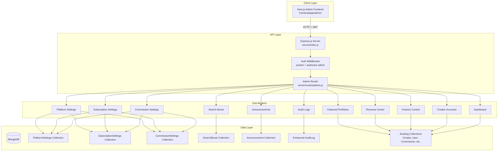

# Design Document: Super Admin Control Panel

## Overview

The Super Admin Control Panel is a comprehensive, database-driven administration system for the BookMyShot platform. It extends the existing Express.js/MongoDB backend with new configuration collections, enhanced audit logging, and dedicated API endpoints that power a full-featured admin interface in the Next.js frontend.

The core design philosophy is **zero-hardcoded business values** — all pricing, commission rates, subscription plans, featured listing costs, and platform settings live in dedicated MongoDB collections and are editable at runtime through the admin panel. The existing admin routes (`/api/admin`) already provide basic creator management, booking management, and notifications. This design builds on that foundation with new models, routes, and UI pages.

### Key Design Decisions

1. **New configuration collections** (PlatformSettings, SubscriptionSettings, CommissionSettings) instead of extending existing models — clean separation of concerns and simpler schema evolution
2. **Seed-on-startup pattern** — application seeds defaults into configuration collections if empty, ensuring the system always has valid configuration
3. **Enhanced AuditLog schema** — adds `previousValues` and `newValues` fields to the existing AuditLog model for full change tracking
4. **Next.js admin frontend** — the admin panel UI lives in `frontend/app/admin/` using the existing DashboardShell layout component and Tailwind CSS
5. **Feature REST API** organized under `/api/admin/` — extends the existing admin router with modular sub-routers for each feature area

## Architecture



### Request Flow

1. Admin user authenticates via `/api/auth/login` and receives a JWT
2. Frontend stores token and includes it as `Authorization: Bearer <token>` header
3. Express middleware (`protect`) validates JWT, loads user from DB
4. Authorization middleware (`authorize("admin")`) verifies `role === "admin"`
5. Request routes to specific admin sub-router
6. Sub-router performs business logic, writes to DB, logs to AuditLog
7. JSON response returned to frontend

## Components and Interfaces

### Backend Components

#### 1. Configuration Service (`server/services/configService.js`)

A utility module providing runtime access to database-stored configuration with in-memory caching (60-second TTL) to reduce repeated DB reads on hot paths.

```javascript
// Interface
module.exports = {
  getPlatformSettings(): Promise<PlatformSettingsDoc>,
  getSubscriptionSettings(): Promise<SubscriptionSettingsDoc>,
  getCommissionSettings(): Promise<CommissionSettingsDoc>,
  invalidateCache(collection: string): void,
  seedDefaults(): Promise<void>
}
```

#### 2. Audit Service (`server/services/auditService.js`)

Centralized audit logging that captures previous and new values for all admin mutations.

```javascript
// Interface
module.exports = {
  logAction({
    adminId: ObjectId,
    adminName: string,
    action: string,
    target: string,
    targetId: string,
    previousValues: object | null,
    newValues: object | null,
    ip: string
  }): Promise<void>
}
```

#### 3. Admin Sub-Routers

| Router File | Base Path | Purpose |
|---|---|---|
| `server/routes/admin/platformSettings.js` | `/api/admin/platform-settings` | CRUD for platform configuration |
| `server/routes/admin/subscriptionSettings.js` | `/api/admin/subscription-settings` | Subscription plan management |
| `server/routes/admin/commissionSettings.js` | `/api/admin/commission-settings` | Commission rate management |
| `server/routes/admin/featuredPortfolios.js` | `/api/admin/featured-portfolios` | Featured creator management |
| `server/routes/admin/searchBoosts.js` | `/api/admin/search-boosts` | Search boost management |
| `server/routes/admin/revenueCenter.js` | `/api/admin/revenue-center` | Revenue aggregation and reporting |
| `server/routes/admin/announcements.js` | `/api/admin/announcements` | Announcement creation and delivery |
| `server/routes/admin/financeControl.js` | `/api/admin/finance` | Payment management and adjustments |
| `server/routes/admin/creatorAccounts.js` | `/api/admin/creator-accounts` | Creator lifecycle management |
| `server/routes/admin/auditLogs.js` | `/api/admin/audit-logs` | Audit log querying |
| `server/routes/admin/dashboard.js` | `/api/admin/dashboard-overview` | Aggregated dashboard metrics |

#### 4. Validation Middleware (`server/middleware/validate.js`)

Express middleware using a lightweight validation approach (manual validation functions or a library like `express-validator`) for request body validation on admin endpoints.

```javascript
// Example usage
router.put("/", validatePlatformSettings, async (req, res, next) => { ... });
```

### Frontend Components

The Next.js admin pages live under `frontend/app/admin/` and use the existing `DashboardShell` layout component.

| Page Route | Component | Purpose |
|---|---|---|
| `/admin` | `page.tsx` | Dashboard overview with metrics |
| `/admin/platform-settings` | `platform-settings/page.tsx` | Platform configuration form |
| `/admin/subscriptions` | `subscriptions/page.tsx` | Subscription plan settings |
| `/admin/commissions` | `commissions/page.tsx` | Commission rate settings |
| `/admin/featured` | `featured/page.tsx` | Featured portfolio management |
| `/admin/search-boosts` | `search-boosts/page.tsx` | Search boost management |
| `/admin/revenue` | `revenue/page.tsx` | Revenue center with filters |
| `/admin/announcements` | `announcements/page.tsx` | Announcement creation |
| `/admin/finance` | `finance/page.tsx` | Finance control panel |
| `/admin/creators` | `creators/page.tsx` | Creator account management |
| `/admin/audit-logs` | `audit-logs/page.tsx` | Audit log viewer |

### API Endpoint Specifications

#### Platform Settings

```
GET    /api/admin/platform-settings       → Get all platform settings
PUT    /api/admin/platform-settings       → Update platform settings (full replace)
```

#### Subscription Settings

```
GET    /api/admin/subscription-settings   → Get subscription config
PUT    /api/admin/subscription-settings   → Update subscription config
```

#### Commission Settings

```
GET    /api/admin/commission-settings     → Get commission rates
PUT    /api/admin/commission-settings     → Update commission rates
```

#### Featured Portfolios

```
GET    /api/admin/featured-portfolios            → List all creators with featured status
POST   /api/admin/featured-portfolios/:creatorId → Feature a creator
DELETE /api/admin/featured-portfolios/:creatorId → Remove from featured
PATCH  /api/admin/featured-portfolios/:creatorId/payment → Approve/reject payment
```

#### Search Boosts

```
GET    /api/admin/search-boosts              → List all boost requests
PATCH  /api/admin/search-boosts/:id/approve  → Approve boost
PATCH  /api/admin/search-boosts/:id/reject   → Reject boost
PATCH  /api/admin/search-boosts/:id/extend   → Extend boost duration
```

#### Revenue Center

```
GET    /api/admin/revenue-center?period=today|week|month|year → Revenue breakdown
```

#### Announcements

```
GET    /api/admin/announcements        → List sent announcements
POST   /api/admin/announcements        → Create and send announcement
```

#### Finance Control

```
GET    /api/admin/finance/history?filters...        → Payment history
POST   /api/admin/finance/manual-payment            → Add manual payment
PATCH  /api/admin/finance/payments/:id/approve      → Approve payment
PATCH  /api/admin/finance/payments/:id/reject       → Reject payment
POST   /api/admin/finance/adjust                    → Revenue/commission adjustment
POST   /api/admin/finance/refund                    → Process refund
```

#### Creator Accounts

```
GET    /api/admin/creator-accounts                        → List all creators
PATCH  /api/admin/creator-accounts/:id/activate           → Activate creator
PATCH  /api/admin/creator-accounts/:id/deactivate         → Deactivate creator
PATCH  /api/admin/creator-accounts/:id/suspend            → Suspend creator
PATCH  /api/admin/creator-accounts/:id/verify             → Verify creator
PATCH  /api/admin/creator-accounts/:id/feature            → Feature creator
PATCH  /api/admin/creator-accounts/:id/extend-subscription → Extend subscription
PATCH  /api/admin/creator-accounts/:id/reset              → Reset settings
```

#### Audit Logs

```
GET    /api/admin/audit-logs?action=&dateFrom=&dateTo=&admin=&target= → Filtered audit logs
```

#### Dashboard Overview

```
GET    /api/admin/dashboard-overview → Aggregated platform metrics
```

## Data Models

### New Models

#### PlatformSettings (`server/models/PlatformSettings.js`)

```javascript
const platformSettingsSchema = new mongoose.Schema({
  siteName: { type: String, default: "BookMyShot" },
  siteDescription: { type: String, default: "Premium Photography Booking Platform" },
  supportEmail: { type: String, default: "support@bookmyshot.com" },
  supportPhone: { type: String, default: "" },
  currency: { type: String, default: "INR" },
  maintenanceMode: { type: Boolean, default: false },
  platformStatus: { type: String, enum: ["active", "maintenance", "offline"], default: "active" },
}, { timestamps: true });
```

Single-document pattern: only one document exists, upserted on update.

#### SubscriptionSettings (`server/models/SubscriptionSettings.js`)

```javascript
const subscriptionSettingsSchema = new mongoose.Schema({
  monthlyPlanPrice: { type: Number, default: 299 },
  yearlyPlanPrice: { type: Number, default: 2999 },
  trialDays: { type: Number, default: 30 },
  autoRenewDefault: { type: Boolean, default: true },
  gracePeriodDays: { type: Number, default: 7 },
  featuredPortfolioPrice: { type: Number, default: 999 },
  searchBoostPrice: { type: Number, default: 499 },
  homepageFeaturedPrice: { type: Number, default: 1499 },
}, { timestamps: true });
```

Single-document pattern.

#### CommissionSettings (`server/models/CommissionSettings.js`)

```javascript
const commissionSettingsSchema = new mongoose.Schema({
  bmsLeadCommissionPercent: { type: Number, default: 5 },
  creatorLeadCommissionPercent: { type: Number, default: 3 },
  latePaymentFeePercent: { type: Number, default: 2 },
  manualAdjustmentPercent: { type: Number, default: 0 },
}, { timestamps: true });
```

Single-document pattern.

#### SearchBoost (`server/models/SearchBoost.js`)

```javascript
const searchBoostSchema = new mongoose.Schema({
  creator: { type: mongoose.Schema.Types.ObjectId, ref: "Creator", required: true },
  boostType: { 
    type: String, 
    enum: ["top_search", "category_priority", "homepage_spotlight"], 
    required: true 
  },
  status: { 
    type: String, 
    enum: ["pending", "active", "expired", "rejected"], 
    default: "pending" 
  },
  startDate: { type: Date },
  endDate: { type: Date },
  paymentStatus: { type: String, enum: ["pending", "paid", "refunded"], default: "pending" },
  paymentAmount: { type: Number, default: 0 },
  rejectionReason: { type: String, default: "" },
  approvedBy: { type: mongoose.Schema.Types.ObjectId, ref: "User" },
}, { timestamps: true });

searchBoostSchema.index({ creator: 1, status: 1 });
searchBoostSchema.index({ endDate: 1, status: 1 });
```

#### Announcement (`server/models/Announcement.js`)

```javascript
const announcementSchema = new mongoose.Schema({
  title: { type: String, required: true },
  message: { type: String, required: true },
  type: { 
    type: String, 
    enum: ["general", "maintenance", "offer", "subscription_reminder", "emergency"], 
    required: true 
  },
  audience: { 
    type: String, 
    enum: ["all_creators", "all_users", "selected_creators", "selected_users"], 
    required: true 
  },
  recipientIds: [{ type: mongoose.Schema.Types.ObjectId, ref: "User" }],
  recipientCount: { type: Number, default: 0 },
  isPopup: { type: Boolean, default: false },
  sentBy: { type: mongoose.Schema.Types.ObjectId, ref: "User", required: true },
}, { timestamps: true });
```

### Modified Models

#### Enhanced AuditLog (`server/models/AuditLog.js`)

Add fields to the existing schema:

```javascript
// New fields to add
adminName: { type: String, default: "" },
previousValues: { type: mongoose.Schema.Types.Mixed, default: null },
newValues: { type: mongoose.Schema.Types.Mixed, default: null },
targetType: { type: String, default: "" },  // "creator", "settings", "payment", etc.
```

#### Enhanced Creator (`server/models/Creator.js`)

Add fields for featured management and verification:

```javascript
// New fields to add
featuredStartDate: { type: Date },
featuredEndDate: { type: Date },
featuredPaymentStatus: { type: String, enum: ["pending", "paid", "rejected", "none"], default: "none" },
verified: { type: Boolean, default: false },
verifiedAt: { type: Date },
```

## Correctness Properties

*A property is a characteristic or behavior that should hold true across all valid executions of a system — essentially, a formal statement about what the system should do. Properties serve as the bridge between human-readable specifications and machine-verifiable correctness guarantees.*

### Property 1: Settings Round-Trip Persistence

*For any* valid platform settings object (with valid email, non-empty site name, valid currency code), saving the settings via the API and then reading them back should return an object equal to what was saved.

**Validates: Requirements 1.3**

### Property 2: Invalid Email Rejection

*For any* string that does not match a valid email format (missing @, missing domain, double dots, special characters in wrong positions), submitting it as the support email should result in a validation error and the settings should remain unchanged.

**Validates: Requirements 1.5**

### Property 3: Numeric Settings Range Validation

*For any* negative number submitted as a price field (monthlyPlanPrice, yearlyPlanPrice, featuredPortfolioPrice, searchBoostPrice, homepageFeaturedPrice), the API should reject the save with a validation error. *For any* commission percentage value below 0 or above 100, the API should reject the save with a validation error.

**Validates: Requirements 2.5, 3.5**

### Property 4: Configuration Changes Do Not Affect Existing Records

*For any* existing booking with a calculated commission, when commission rates are updated in CommissionSettings, the existing booking's commission amount and percentage should remain unchanged. *For any* existing active subscription, when subscription pricing is updated in SubscriptionSettings, the existing subscription's amount should remain unchanged.

**Validates: Requirements 2.3, 3.3**

### Property 5: Universal Audit Logging

*For any* admin mutation operation (settings update, creator action, finance action, boost action, announcement), executing the operation should produce exactly one new AuditLog entry containing: the admin's ID, the admin's name, a non-empty action string, a timestamp within 1 second of the operation, and non-null previousValues and newValues for data-modifying operations.

**Validates: Requirements 1.6, 2.6, 3.6, 4.7, 5.8, 7.7, 8.8, 9.9, 10.1, 10.2**

### Property 6: Feature/Unfeature Round-Trip

*For any* creator that is not currently featured, featuring them should set featured=true with a valid startDate and endDate where endDate > startDate. Subsequently removing them from featured should set featured=false and record an endDate. The final state should have featured=false.

**Validates: Requirements 4.2, 4.3**

### Property 7: Search Boost Approval Activates for Correct Duration

*For any* pending search boost request with a specified duration (in days), approving the boost should set status="active", set startDate to approximately now, and set endDate to startDate + duration days.

**Validates: Requirements 5.4**

### Property 8: Search Boost Extension Increases End Date

*For any* active search boost with an existing endDate and any positive extension duration, extending the boost should produce a new endDate that equals the old endDate plus the extension duration.

**Validates: Requirements 5.6**

### Property 9: Revenue Time Filter Correctness

*For any* set of payments with known dates and a selected time period (today/week/month/year), the revenue totals returned by the API should include only payments whose dates fall within the selected period's boundaries, and the total platform revenue should equal the sum of all individual revenue stream totals.

**Validates: Requirements 6.3, 6.4**

### Property 10: Announcement Notification Fan-Out

*For any* announcement with a defined recipient list of N users, sending the announcement should create exactly N notification records, one for each recipient. Additionally, if the announcement type is "emergency" or "maintenance", each created notification should have the popup flag set to true.

**Validates: Requirements 7.4, 7.5**

### Property 11: Required Field Validation for Financial Operations

*For any* manual payment request missing any of: target creator, amount, payment type, or reason note — the API should reject it with a validation error. *For any* refund request missing any of: original payment reference, refund amount, or reason — the API should reject it. *For any* adjustment request missing any of: target booking/creator, adjustment amount, or justification — the API should reject it.

**Validates: Requirements 8.2, 8.4, 8.5**

### Property 12: Refund Cannot Exceed Original Payment

*For any* payment record with an original amount X and any attempted refund amount Y where Y > X, the refund should be rejected with a validation error and the payment status should remain unchanged.

**Validates: Requirements 8.6**

### Property 13: Payment History Filter Correctness

*For any* set of payment records with varying dates, creators, payment types, and statuses, applying a filter combination should return only records that match ALL specified filter criteria simultaneously.

**Validates: Requirements 8.7**

### Property 14: Creator State Transitions Produce Correct Outcomes

*For any* creator, activating should result in status="approved" with a notification sent. Deactivating should result in status="rejected" and the creator excluded from public search results. Suspending should result in subscriptionStatus="suspended" with a notification containing the suspension reason.

**Validates: Requirements 9.2, 9.3, 9.4**

### Property 15: Subscription Extension Advances End Date

*For any* creator with an existing subscription end date and any positive extension duration, extending the subscription should produce a new end date that is later than the previous end date by exactly the extension duration, and a notification should be sent to the creator.

**Validates: Requirements 9.7**

### Property 16: Creator Settings Reset Restores Defaults

*For any* creator with arbitrarily modified profile preferences, resetting their settings should restore all preference fields to their predefined default values, regardless of what values were previously set.

**Validates: Requirements 9.8**

### Property 17: Audit Log Immutability

*For any* existing audit log entry, any attempt to update or delete the entry through the API should be rejected, and the entry should remain unchanged in the database.

**Validates: Requirements 10.5**

### Property 18: Audit Log Ordering

*For any* paginated request to the audit log endpoint, the returned entries should be in strictly descending chronological order (each entry's timestamp >= the next entry's timestamp).

**Validates: Requirements 10.6**

### Property 19: Configuration Seeding Idempotence

*For any* initial state of the configuration collections (empty or populated), running the seed operation should result in all configuration collections having valid documents. If values already existed, they should remain unchanged (idempotent). If collections were empty, default values should be created.

**Validates: Requirements 12.5**


## Error Handling

### API Error Response Format

All admin API endpoints return errors in a consistent format:

```json
{
  "success": false,
  "message": "Human-readable error description",
  "errors": [{ "field": "fieldName", "message": "Specific validation error" }]
}
```

### Error Categories

| Category | HTTP Status | Example |
|---|---|---|
| Authentication failure | 401 | Missing or expired JWT token |
| Authorization failure | 403 | Non-admin user accessing admin endpoints |
| Validation error | 400 | Invalid email format, negative price, missing required field |
| Not found | 404 | Creator ID doesn't exist, payment reference not found |
| Business rule violation | 422 | Refund exceeds original payment, commission > 100% |
| Database unavailable | 503 | MongoDB connection lost during operation |
| Internal error | 500 | Unexpected exceptions |

### Error Handling Strategy

1. **Validation errors** — Caught at the middleware level before reaching business logic. All field validation runs synchronously and returns all errors at once (not one-at-a-time).

2. **Database failures** — The existing `errorHandler` middleware catches unhandled exceptions. For configuration reads, the ConfigService falls back to defaults and logs a warning.

3. **Concurrent modifications** — For single-document settings (PlatformSettings, SubscriptionSettings, CommissionSettings), MongoDB's document-level locking prevents conflicts. For multi-step operations (feature creator + create notification), failures mid-operation are logged but don't roll back — the audit log captures the partial state.

4. **Audit logging failures** — Audit log creation is best-effort. If the audit write fails, the primary operation still succeeds but the error is logged to the server console. The `logAction` helper already wraps in try/catch.

5. **Configuration fallback** — When `ConfigService.getPlatformSettings()` fails or returns null, it returns hardcoded default values and logs a warning. This ensures the platform never completely breaks due to missing config.

### Maintenance Mode Handling

When maintenance mode is enabled via PlatformSettings:
- A middleware checks `PlatformSettings.maintenanceMode` on every non-admin, non-auth request
- Non-admin users receive a `503` response with a maintenance message
- Admin users bypass the check entirely
- The check uses the ConfigService cache (60s TTL) to avoid DB queries on every request

## Testing Strategy

### Testing Framework

- **Unit/Property Tests**: [fast-check](https://github.com/dubzzz/fast-check) with Node.js built-in test runner or Jest (matching the existing project setup)
- **Integration Tests**: Supertest for HTTP endpoint testing against a test MongoDB instance
- **Property-based testing library**: fast-check (JavaScript PBT library)

### Test Organization

```
tests/
├── unit/
│   ├── services/
│   │   ├── configService.test.js
│   │   └── auditService.test.js
│   └── validation/
│       ├── platformSettings.test.js
│       ├── subscriptionSettings.test.js
│       ├── commissionSettings.test.js
│       └── financeControl.test.js
├── property/
│   ├── settingsRoundTrip.property.test.js
│   ├── validation.property.test.js
│   ├── auditLogging.property.test.js
│   ├── revenueCalculation.property.test.js
│   ├── announcementFanOut.property.test.js
│   ├── creatorStateTransitions.property.test.js
│   ├── searchBoost.property.test.js
│   └── configSeeding.property.test.js
├── integration/
│   ├── platformSettings.integration.test.js
│   ├── subscriptionSettings.integration.test.js
│   ├── commissionSettings.integration.test.js
│   ├── featuredPortfolios.integration.test.js
│   ├── searchBoosts.integration.test.js
│   ├── revenueCenter.integration.test.js
│   ├── announcements.integration.test.js
│   ├── financeControl.integration.test.js
│   ├── creatorAccounts.integration.test.js
│   └── auditLogs.integration.test.js
└── helpers/
    ├── dbSetup.js
    ├── generators.js
    └── fixtures.js
```

### Property-Based Testing Configuration

- **Library**: fast-check
- **Minimum iterations**: 100 per property test
- **Tag format**: `Feature: super-admin-control-panel, Property {number}: {title}`

Each property test file implements one or more correctness properties from the design:

| Property Test File | Properties Covered |
|---|---|
| `settingsRoundTrip.property.test.js` | Property 1, Property 19 |
| `validation.property.test.js` | Properties 2, 3, 11, 12 |
| `auditLogging.property.test.js` | Properties 5, 17, 18 |
| `revenueCalculation.property.test.js` | Property 9 |
| `announcementFanOut.property.test.js` | Property 10 |
| `creatorStateTransitions.property.test.js` | Properties 4, 6, 14, 15, 16 |
| `searchBoost.property.test.js` | Properties 7, 8 |
| `configSeeding.property.test.js` | Property 19 |
| `financeFilters.property.test.js` | Property 13 |

### Unit Tests (Example-Based)

Unit tests cover specific examples, edge cases, and scenarios that don't benefit from randomized input:

- Maintenance mode toggle behavior (enable → non-admin sees 503)
- Featured listing expiry automation (past date triggers removal)
- Search boost expiry automation
- Announcement type enum validation
- Dashboard metric calculation with known data
- UI navigation from dashboard metric click

### Integration Tests

Integration tests verify end-to-end behavior against a real MongoDB test instance:

- Full CRUD flows for each settings collection
- Creator lifecycle: pending → approved → featured → suspended → reactivated
- Payment flow: manual payment → approve/reject → audit logged
- Revenue aggregation with time filters
- Announcement broadcast delivery
- Search boost purchase → approve → expire cycle

### Test Generators (fast-check Arbitraries)

Key generators for property tests:

```javascript
// Valid platform settings
const arbPlatformSettings = fc.record({
  siteName: fc.string({ minLength: 1, maxLength: 100 }),
  siteDescription: fc.string({ maxLength: 500 }),
  supportEmail: fc.emailAddress(),
  supportPhone: fc.string({ maxLength: 15 }),
  currency: fc.constantFrom("INR", "USD", "EUR", "GBP"),
  maintenanceMode: fc.boolean(),
  platformStatus: fc.constantFrom("active", "maintenance", "offline"),
});

// Invalid emails
const arbInvalidEmail = fc.oneof(
  fc.string().filter(s => !s.includes("@")),
  fc.string().map(s => s + "@@double.com"),
  fc.constant(""),
  fc.string().map(s => "@" + s),
);

// Valid commission rates (0-100)
const arbValidCommissionRate = fc.float({ min: 0, max: 100 });

// Invalid commission rates (outside 0-100)
const arbInvalidCommissionRate = fc.oneof(
  fc.float({ min: -1000, max: -0.01 }),
  fc.float({ min: 100.01, max: 1000 }),
);

// Random payment records for filter testing
const arbPaymentRecord = fc.record({
  amount: fc.float({ min: 0.01, max: 100000 }),
  paymentType: fc.constantFrom("advance", "partial", "final", "other"),
  status: fc.constantFrom("pending", "approved", "rejected"),
  createdAt: fc.date({ min: new Date("2024-01-01"), max: new Date("2025-12-31") }),
});
```
